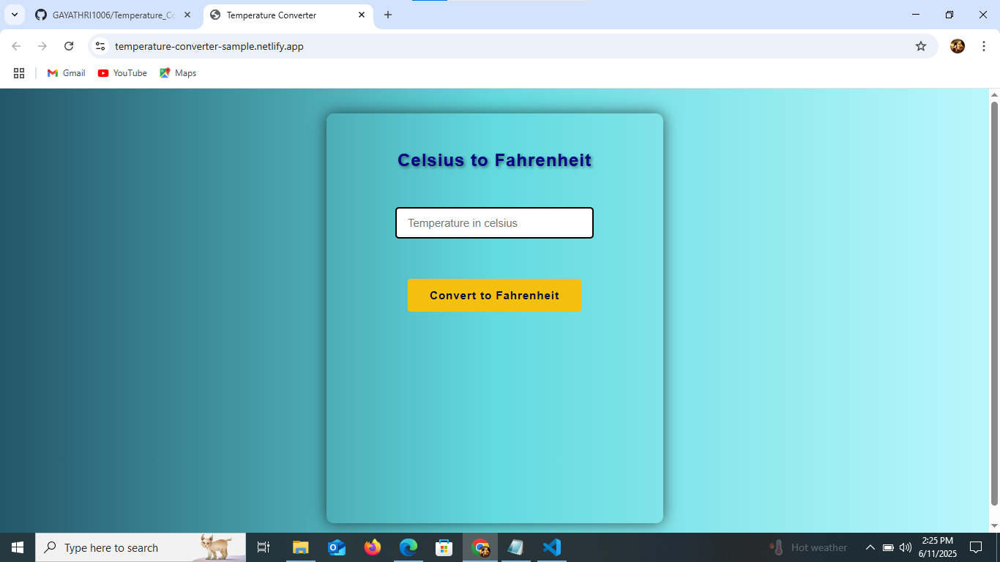
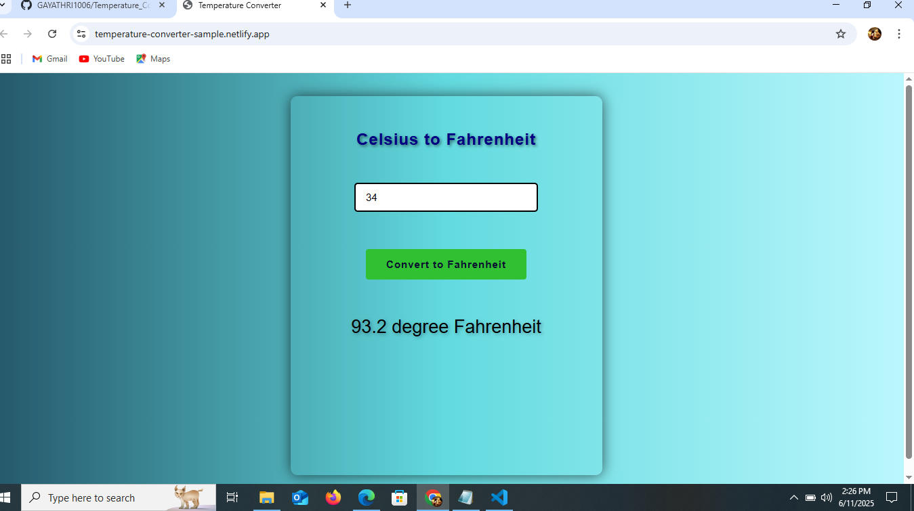

# Temperature Converter – Celsius to Fahrenheit

A simple and accurate **Temperature Converter** built with **HTML**, **CSS**, and **JavaScript**. This tool helps you convert temperatures from Celsius to Fahrenheit instantly.

## Demo

🔗 [Live Demo](https://temperature-converter-sample.netlify.app/)  

## Developed By
**Gayathri G**  
GitHub: [GAYATHRI1006](https://github.com/GAYATHRI1006)

## Screenshot

  
  

## Features

- Converts Celsius to Fahrenheit with one click
- Clean and responsive design
- Real-time result display
- Input validation for better user experience

## Conversion Formula

Fahrenheit = (Celsius × 9/5) + 32

## How to Use

1. Open the `index.html` file in your browser.
2. Enter a temperature value in Celsius.
3. Click on **Convert to Fahrenheit**.
4. The result will be displayed below the button.

## Input Validation

- If the input field is empty or not a number:  
  `Please enter a valid input`
  
## 🛠️ Technologies Used

- **HTML** – Page structure
- **CSS** – Styling (linked in `style.css`)
- **JavaScript** – Temperature conversion logic and input validation
